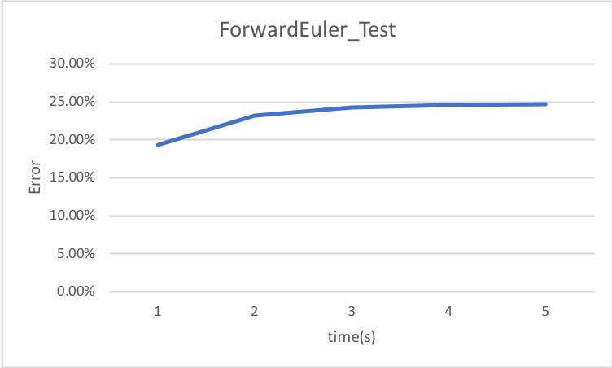
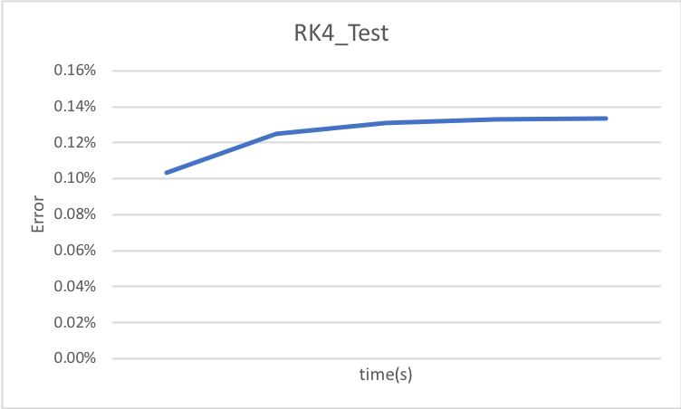
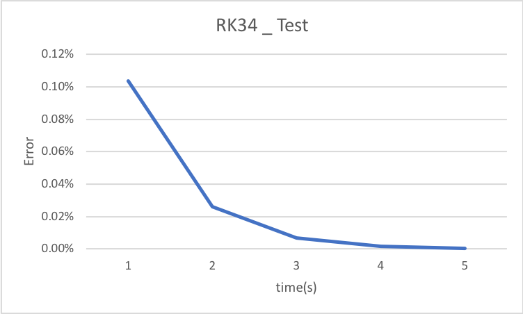
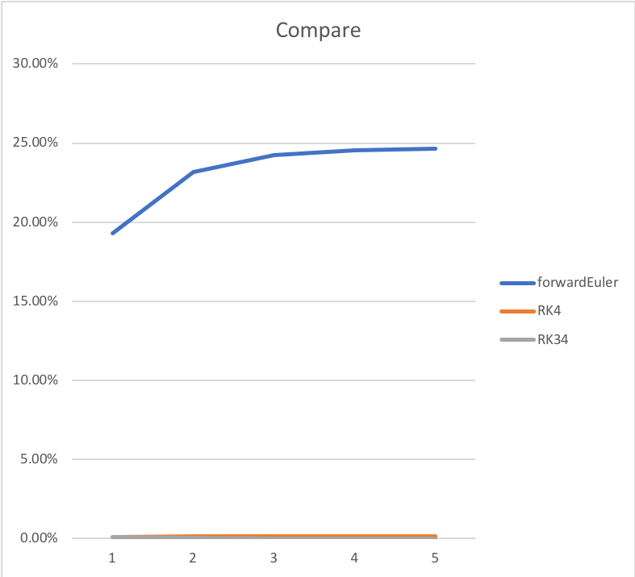

<h3>Introduction</h3>

In this lab, we need to use ODE solver (forward euler method, RK4, RK34) to solve two circuits.

  

<h3>Folder structure</h3>

In Lab4 foler, there are source code for this lab. 

In output foler, there is the raw output from the software. 

In task2 foler, there is the discussion about the change and the inheritance between the assignments and the lab. 

In task3 foler, there are the result images for the test case. 

In task4 foler, there are the result images for the RC circuit. 

In task5 foler, there are the result images for the EKV module circuit. 

  

<h3>task2</h3>

CHANGES:

1. I change the inputs of my previous assignment. 
In my previous assignment, I use a outer for loop to give the time to the solver.
While in lab4, I set exit time and delta time to the input of the function, so I can change the simulation time and interval easily.

2. And in the RK4 and RK34, I make a intermediate variable for all time (ti, ti + h/2, ti + h) and x (xi, xi + k1h/2, xi + k2h/2, xi + k3h) when we calculate K1 to K4. I changed this to make the code more clear and easier to debug. Because later on, the ODE will be more and more complicated.

3. I make the related variable to be vector. Because the rank of the dependent variable is no longer 1. So I need to use vector to represent the variable. I use Eigen library to achieve the vector feature.

INHERITANCE:
1. For Forward Euler method, I used the way to predict the next dependent value. 

2. For the RK4, I used the parameters for calculating K1 to K4 from my assignments.

3. For RK34, I used the time adaptation equation I used in my assignment.

  

<h3>task3 (test case)</h3>

  

<h3>task4 (RC circuit)</h3>

  

<h3>task5 (EKV module)</h3>

  

